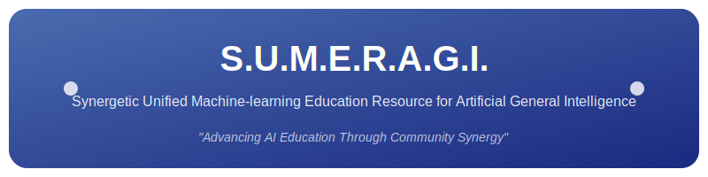

<div align="center">
  

  # S.U.M.E.R.A.G.I.

</div>

## 🌟 プロジェクト概要

S.U.M.E.R.A.G.I.（スメラギ）は、AI学習コミュニティのためのDiscord Botプロジェクトです。AIに関する学習リソースの提供、イベント管理、コミュニティ活動のサポートなどの機能を備えています。

「S.U.M.E.R.A.G.I.」は「**S**ynergetic **U**nified **M**achine-learning **E**ducation **R**esource for **A**rtificial **G**eneral **I**ntelligence」の頭字語で、以下の意味を持ちます：

- **S**ynergetic（相乗的な）：メンバー同士やAIシステムが協力し合って相乗効果を生み出すコミュニティ
- **U**nified（統一された）：様々なAI技術や知識が体系的にまとめられている
- **M**achine-learning（機械学習）：AIの核となる技術に焦点を当てている
- **E**ducation（教育）：初心者に向けた学びの場を提供
- **R**esource（リソース）：有益な学習材料やツール、情報を提供するプラットフォーム
- **A**rtificial（人工的な）：人工知能に関するコミュニティ
- **G**eneral（汎用的な）：特定分野だけでなく幅広いAI技術や知識を扱う
- **I**ntelligence（知能）：AIの「知能」という側面に焦点

## 📂 リポジトリ構成

このリポジトリは以下のディレクトリと内容で構成されています：

- 📁 **example/** - Discord Botのサンプル実装
  - 📄 **bot.py** - メインのBot実装
  - 📄 **event_manager.py** - イベント管理モジュール
  - 📄 **resource_manager.py** - リソース管理モジュール
  - 📄 **run.py** - Botの起動スクリプト
  - 📄 **requirements.txt** - 必要な依存関係
  - 📁 **assets/** - 画像などのアセット
  - 📄 **.env.example** - 環境変数設定の例

## 🚀 始め方

サンプル実装を使い始めるには、以下の手順に従ってください：

1. リポジトリをクローン
```bash
git clone https://github.com/yourusername/sumeragi.git
cd sumeragi/example
```

2. 依存関係をインストール
```bash
pip install -r requirements.txt
```

3. 環境変数の設定
```bash
cp .env.example .env
# .envファイルを編集してDiscordトークンを設定
```

4. Botを起動
```bash
python run.py
```

## 📋 主な機能

- 🤖 **基本的なコマンド** - ヘルプ、説明、トピック提案など
- 📚 **リソース管理** - AIに関する学習リソースの共有と検索
- 📅 **イベント管理** - コミュニティイベントの管理と通知
- 👋 **メンバー対応** - 新規メンバーの歓迎メッセージなど

## 🛠️ 開発について

詳細は`example/README.md`を参照してください。コントリビューションやカスタマイズの方法について説明しています。

## 📄 ライセンス

このプロジェクトはMITライセンスの下で公開されています。詳細は[LICENSE](./LICENSE)ファイルを参照してください。