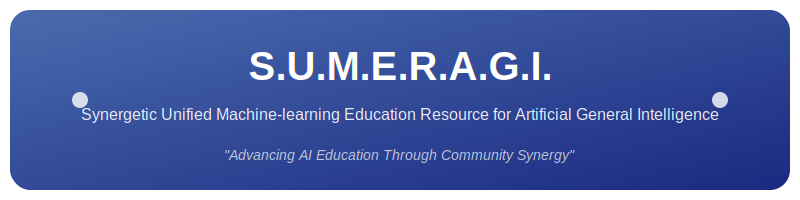

# S.U.M.E.R.A.G.I. Discord Bot

<p align="center">
  
</p>

## 📝 概要

S.U.M.E.R.A.G.I.（スメラギ）は、AIコミュニティのためのDiscord Botです。AIに関する学習リソースの提供、イベント管理、コミュニティ活動のサポートなどの機能を備えています。

「S.U.M.E.R.A.G.I.」は「**S**ynergetic **U**nified **M**achine-learning **E**ducation **R**esource for **A**rtificial **G**eneral **I**ntelligence」の頭字語で、「相乗効果を生み出す統一された機械学習教育リソースを通じて汎用人工知能について学べるコミュニティ」を意味します。

## 💻 機能

- 🤖 **基本的なコマンド**
  - `!help` - ヘルプメニューの表示
  - `!about` - S.U.M.E.R.A.G.I.の説明
  - `!topic` - AIに関するランダムなトピックを提案

- 📚 **リソース管理**
  - `!resource list [カテゴリ]` - リソース一覧を表示
  - `!resource search <検索語>` - リソースを検索
  - `!resource add <カテゴリ> <タイトル> <URL> <説明>` - リソースを追加（管理者のみ）
  - `!resource delete <ID>` - リソースを削除（管理者のみ）
  - `!resource update <ID> <フィールド> <新しい値>` - リソース情報を更新（管理者のみ）

- 📅 **イベント管理**
  - `!event list` - イベント一覧を表示
  - `!event add <名前> <日時> <説明>` - イベントを追加（管理者のみ）
  - `!event delete <ID>` - イベントを削除（管理者のみ）
  - `!event update <ID> <フィールド> <新しい値>` - イベント情報を更新（管理者のみ）

- 🎉 **その他の機能**
  - 新メンバー参加時のウェルカムメッセージ
  - 定期的なステータス更新
  - イベント通知

## 🚀 セットアップ方法

### 前提条件

- Python 3.8以上
- Discordアカウントとボットトークン

### インストール手順

1. リポジトリをクローン
```bash
git clone https://github.com/yourusername/sumeragi-discord-bot.git
cd sumeragi-discord-bot
```

2. 依存関係をインストール
```bash
pip install -r requirements.txt
```

3. 環境変数の設定
`.env.example`ファイルを`.env`にコピーして必要な情報を入力します。
```bash
cp .env.example .env
```

`.env`ファイルを編集して、以下の情報を設定してください：
```
DISCORD_TOKEN=あなたのDiscordトークン
COMMAND_PREFIX=!
```

4. Botを起動
```bash
python run.py
```

## 🛠️ カスタマイズ

### リソースの追加

初回起動時にデフォルトのリソースが自動的に作成されますが、Botの管理コマンドを使って追加・編集できます。

### イベントの管理

`!event add`コマンドでイベントを追加できます。イベントは自動的に通知されます。

### 新機能の追加

新しい機能を追加するには、Cogの形式でモジュールを作成し、`run.py`の`cogs`リストに追加してください。

## 📄 ライセンス

このプロジェクトはMITライセンスの下で公開されています。詳細は[LICENSE](../LICENSE)ファイルを参照してください。

## 👥 コントリビューション

プロジェクトへの貢献は歓迎します！バグ報告、機能リクエスト、プルリクエストなどお待ちしています。

## 📬 連絡先

質問や提案がある場合は、Issueを作成するか、以下の連絡先までご連絡ください：
- Discord: あなたのDiscordユーザー名
- Email: your.email@example.com
